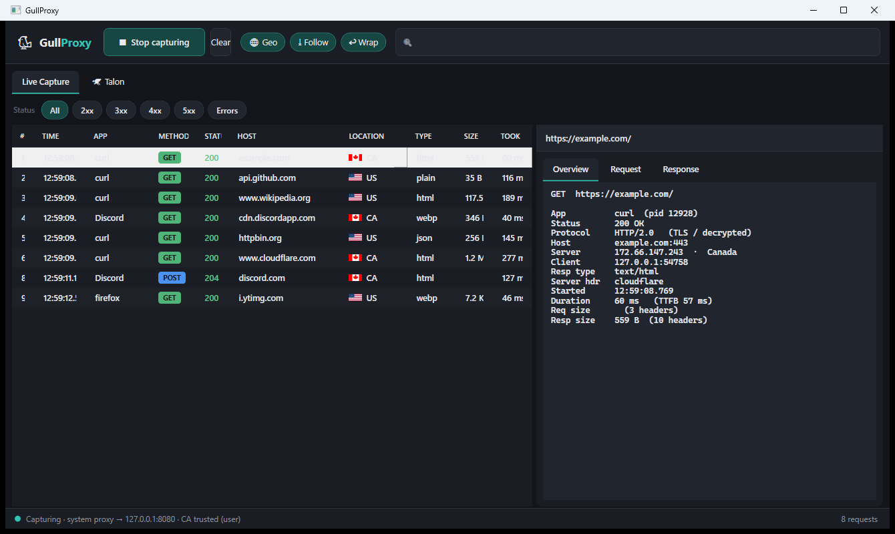
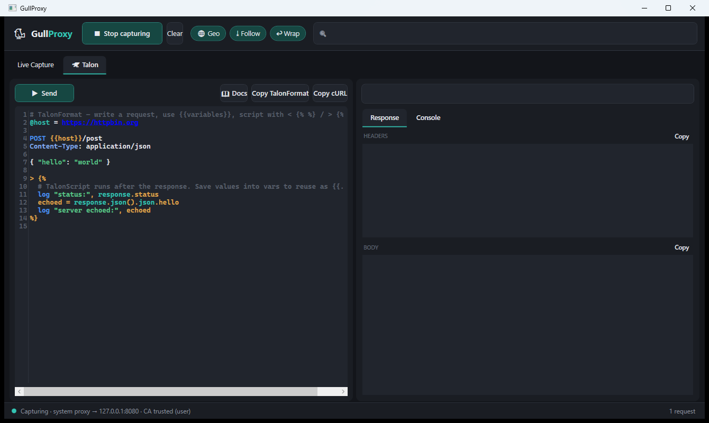

<div align="center">

# GullProxy

### See every request your PC makes — decrypted, attributed, and scriptable.

A local **HTTPS-intercepting proxy** with a native Windows UI. Inspect all your machine's
traffic (headers, bodies, timing, TLS), find out **which app** sent each request, and replay or
craft requests with a built-in editor and its own scripting language.




</div>

---

## 🪶 Features

-  **Full HTTPS decryption** — man-in-the-middles TLS with an auto-generated root CA, so you
  see decrypted request/response bodies, not opaque tunnels.
-  **Which app sent it** — every request is attributed to the local process that made it
  (Firefox, Discord, curl…), resolved from the OS TCP table.
-  **Server geolocation** — resolves each server's IP and country, shown with a real flag.
-  **Streaming & fast** — bodies stream (downloads/SSE work), failures fail fast with a 502
  instead of hanging, and it **never leaves your system proxy broken** (restored on exit/crash).
-  **HTTP/2 & HTTP/3 to origins** via `HttpClient`; HTTP/1.1 to the browser for rock-solid
  compatibility.
-  **Rich inspection** — colored method/status, status filters, live search, pretty-printed
  JSON, TTFB + total timing, content types, encodings, header counts, and TLS/plaintext.
-  **WebSocket-aware** — upgrade connections are relayed and logged.
-  **Talon** — a request editor + replayer with a single portable text format
  (**TalonFormat**) and its own embedded scripting language (**TalonScript**), with syntax
  highlighting and in-app docs.
-  **Native desktop UI** (WPF, dark theme). No browser tab, no console.
-  **Single self-contained `.exe`** — nothing to install (bundles the runtime).

---

##  Quick start

1. **Download** `GullProxy.exe` from the [Releases](../../releases) page.
2. **Run it.** (It's unsigned, so Windows SmartScreen may warn — *More info → Run anyway*.)
3. On first launch it installs its root CA and turns on the system proxy, then starts capturing.
   -  **Using Firefox?** Fully quit and reopen it once — GullProxy configures Firefox to trust
     the CA, but Firefox only reads that on startup. Chrome/Edge need no extra step.
4. Browse as usual and watch requests stream in. Press **Stop capturing** (or close the window)
   to instantly restore normal networking.

> ⚠️ **Safety & privacy.** GullProxy only touches **your** machine's own traffic and trust
> store, and restores your system proxy on exit — even after a crash. The generated CA private
> key (`%LOCALAPPDATA%\GullProxy\rootCA.pfx`) can mint certificates your machine trusts; keep it
> private and never share it. This is a debugging tool in the spirit of Fiddler / Charles /
> mitmproxy.

---

##  🦅Talon — replay, craft & script requests

Right-click any captured request → **Send to Talon**, then edit and re-send it. Talon is a single
code editor using **TalonFormat** (method, URL, headers, body, `{{variables}}`), and you can embed
**TalonScript** to automate — e.g. log in, capture a token, and reuse it automatically:

```
@host = https://api.example.com

POST {{host}}/login
Content-Type: application/json

{ "user": "alice", "pass": "hunter2" }

> 
```

Then `{{token}}` is available in your next request. TalonScript is a full little language —
variables, `if`/`else`, `for`/`while`, math, strings, regex, crypto (`sha256`, `hmacSha256`),
JSON, and ~70 builtins. **Full reference:** [docs/TalonScript.md](docs/TalonScript.md) (also
available via the **📖 Docs** button in the app).

<div align="center">



</div>

---

## 🛠️ How it works

```
 App / Browser ──HTTP / CONNECT──▶  GullProxy  (127.0.0.1:8080)
                                      │  identifies the owning process (OS TCP table)
                                      ├─ terminates client TLS with a per-host leaf cert
                                      │     (ALPN http/1.1 — a protocol we can read)
                                      ├─ streams the request through a shared HttpClient …
                                      │     … which speaks HTTP/1.1, HTTP/2 or HTTP/3 to the origin
                                      └─ streams the response back (chunked) while tee-ing a copy
                                      ▼
                               TransactionStore ──▶ WPF UI  +  Talon
```

Terminating the **client** leg as HTTP/1.1 (browsers always support that to a proxy) while the
**origin** leg uses `HttpClient` gives full visibility of every request — including the real
origin protocol — without a fragile hand-written HTTP/2 server that could break sites.

**Project layout**

| Path | What's there |
|------|--------------|
| `src/GullProxy/Engine` | the intercepting proxy engine (streaming, HttpClient upstream) |
| `src/GullProxy/Proxy` | the HTTP/1.1 request reader for the client leg |
| `src/GullProxy/Tls` | root-CA generation (pure .NET) + per-host leaf cert cache |
| `src/GullProxy/System` | trust-store install, fail-safe system-proxy toggle, process resolver |
| `src/GullProxy/Net` | geolocation, flag images, Firefox CA trust |
| `src/GullProxy/Capture` | transaction model, ring buffer, gzip/deflate/br decoding |
| `src/GullProxy/Ui` | WPF view-models, **TalonFormat** + **TalonScript** |

---

## 🧑‍💻 Build from source

Requires the **.NET 10 SDK** on Windows.

```powershell
git clone <your-repo-url>
cd LAWRProxy
dotnet run --project src/GullProxy -c Release
```

Produce a self-contained single-file exe:

```powershell
dotnet publish src/GullProxy -c Release -r win-x64 --self-contained true `
  -p:PublishSingleFile=true -p:IncludeNativeLibrariesForSelfExtract=true
# → src/GullProxy/bin/Release/net10.0-windows/win-x64/publish/GullProxy.exe
```

---

## 📓 Notes & limitations

- **Windows only** (uses the Windows trust store, WinINET proxy, and TCP table).
- Response bodies stream; up to 1 MB of each is kept for display (true wire size is shown).
- WebSocket / HTTP-Upgrade traffic is relayed and logged, but frames aren't decoded.
- Geolocation sends each unique **server IP** (not your data) to ip-api.com; flags come from
  flagcdn.com. Turn the **🌐 Geo** toggle off to disable all external lookups.
- Captures this machine only (binds to `127.0.0.1`).
- To remove the trusted root CA later: delete it from **certmgr** (Trusted Root Certification
  Authorities → “GullProxy Root CA”) or wipe `%LOCALAPPDATA%\GullProxy\`.

---

## 📄 License

[MIT](LICENSE) — do what you like; no warranty.
